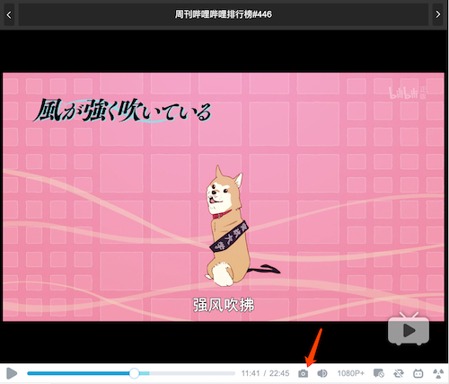
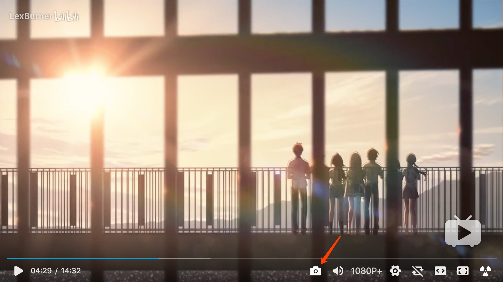

# Bilibili Screenshot

A userscript that adds a button on bilibili player, which can be used to take a screenshot of current playing video.

## Installation

<https://raw.githubusercontent.com/laysent/bilibili-screenshot-button/master/index.user.js>

## Preview

## Known Issues

+ When move progress bar, the first screenshot might be blank. Take screenshot second time will work.
+ When quality of video is low (i.e. 360p), screenshot might not work, as video is stored on CDN and taking screenshot is facing cross domain issue.
